<div align="center">



**A daily scheduler that ranks your inbox by regret, not urgency.**

Built for the student freelancer juggling classes, client work and a job hunt at once —
several inboxes, one life, no patience for another app that just lists things.

[](askcal-api)
[]()
[]()
[]()

</div>


## What it actually does

Every email doesn't deserve the same amount of your attention. Askcal reads your mail with
Claude, scores each message by **regret** — what it costs you to ignore it, not how loudly it
shouts — and turns the ones that matter into tasks on your day, already slotted around your
calendar.

- **Regret-ranked inbox**, grouped by what each mail wants from you: a reply, a deadline,
  a read when you have a minute, or nothing at all.
- **Auto-tasking with real gates.** Actionable mail — a due invoice, an assessment link, a
  client brief — becomes a task the moment it is classified. A confidence floor and a stakes
  floor stop the model's guesses becoming your workload.
- **Tracks you name yourself.** Not folders and not a fixed five: you write what belongs in
  each one, and *that description* is what the classifier reads. A track can be switched off,
  or set to never make work.
- **Several mailboxes, one day.** College mail and personal mail arrive in the same list.
  Each mailbox carries the tracks its mail is usually about, passed to the classifier as a
  leaning — never a rule, so a bill at a college address is still about money.
- **A day that plans itself.** Tasks flow around your real Google Calendar busy blocks; pin
  one to an exact time and everything else routes around it, never landing in the past.
- **A page you can write on.** Every day has one, in markdown, handwritten with a Pencil on
  iPad via Scribble — which converts to text, so the note is searchable and readable on your
  phone.
- **A morning digest and an evening nudge** that say something: what today asks of you,
  and how it actually went.


## The design

Warm paper, ruled, with a red margin line. New York for anything written, mono for times and
counts — a rule the whole app keeps, so a number always looks like a number. One check shape,
one heading hierarchy, one page container that every screen is built from.

On iPad it opens flat: the day on the left, the day's page on the right. That is decided by
measuring the window rather than reading the size class, so it follows a Split View divider
as you drag it.

Both themes clear 4.5:1 on every surface — page, card and recessed well — verified against a
contrast checker rather than assumed.


## How it fits together

```
Gmail ──► ingest ──► classify (Claude) ──► regret score ──► auto-task ──► your day
              │            │                                    │
        every mailbox   your tracks,                    confidence + stakes
        you connected   in your words                        floors
```

Classification never blocks ingestion: mail lands immediately and is scored in batches
afterwards, so a slow model never costs you an inbox.

| | |
|---|---|
| **iOS app** | SwiftUI, iOS 26.4, `@Observable`. Optimistic writes with rollback — a create shows instantly and says so if the server refuses. |
| **Backend** | FastAPI, SQLAlchemy async, Alembic, Postgres. Deployed with Docker Compose behind Caddy. |
| **Classifier** | Claude via the Claude Code CLI (a Gemini path exists behind a setting). Structured output validated against the same model the prompt is generated from, so prompt and parser cannot drift. |
| **Secrets** | Google refresh tokens are encrypted at rest; `/health` reports whether that is on. |


## Running it

The backend, with Postgres:

```bash
cd askcal-api
cp .env.example .env          # fill in Google OAuth + a JWT secret
docker compose up -d
uv run pytest                 # 271 tests, no database required
```

The app: open `Askcal/Askcal.xcodeproj`, set the API base URL in Settings (defaults to the
hosted one), and run. Sign in with Google to connect a mailbox.

Full backend setup, deployment overlays and the API contract are in
[`askcal-api/README.md`](askcal-api/README.md).


## Repository

```
Askcal/            iOS app
  DesignSystem/    the page, the row, the palette, the type scale
  Views/           one file per screen
  State/           AskcalStore — the single source of truth
  Services/        APIClient
askcal-api/        FastAPI backend
  app/routers/     one per resource
  app/services/    classifier, regret, scheduling, sync, digests
  app/scripts/     one-off maintenance, dry-run by default
  alembic/         migrations
scripts/           generate_header.py — regenerates the artwork above
assets/            header.svg, divider.svg (generated; don't hand-edit)
```

The header is hand-built SVG with no images, no external fonts and no third-party services.
Animation is CSS gated behind `prefers-reduced-motion`, so everything readable stays readable
without it. Regenerate with `python3 scripts/generate_header.py`.
